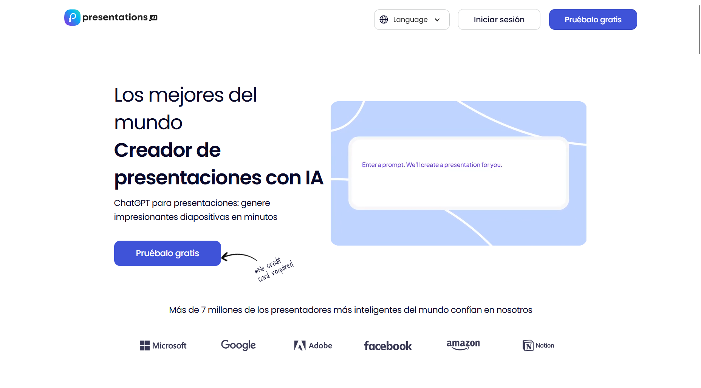
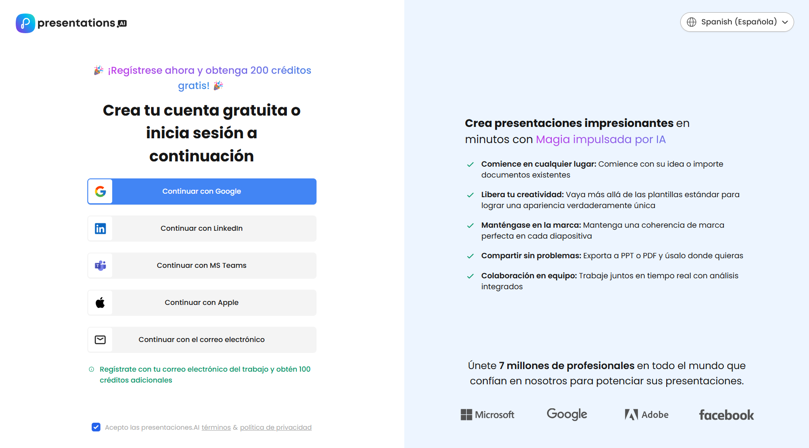
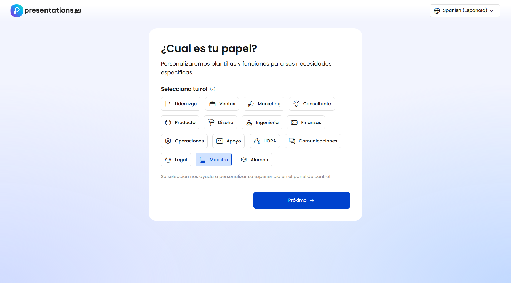
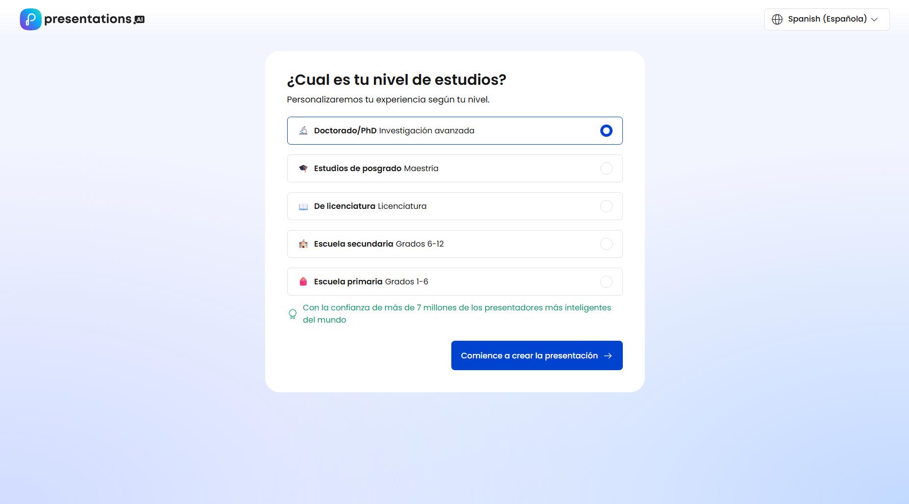
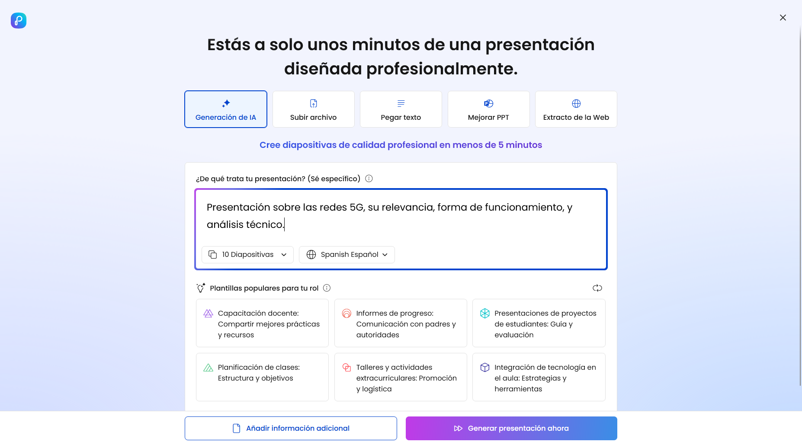
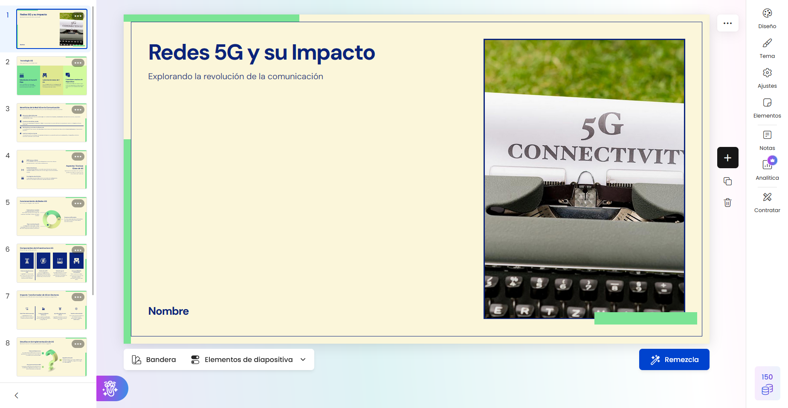

# Crear presentaciones
En este artículo te mostraremos cómo crear presentaciones de forma sencilla con PresentationsAI.
::: warning Aviso
Actualmente, no encontramos herramientas que entregen esta funcionalidad de forma gratuita. Si deseas usar PresentationsAI de forma reiterada y/o descargar los PPTs generados, deberás pagar una suscripción. Actualizaremos este artículo si esto cambia.
:::

Puedes probar esta herramienta de forma gratuita. Selecciona el botón "prébalo gratis" para comenzar.

Luego, selecciona el método para crear una cuenta. Te sugerimos ingresar con Google.

Luego deberás seleccionar tu rol y tu nivel de educación.

Ya en la página principal, ingresa un _prompt_ de lo que quieres que sea la presentación.

Después de unos minutos, la presentación estará lista para editar y ajustar, con gran parte del contenido ya listo.

::: tip Sugerencia
La página entrega la opción de presentar el PPT ahí mismo en pantalla completa.
:::