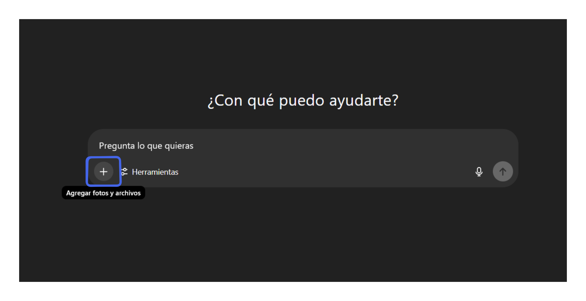
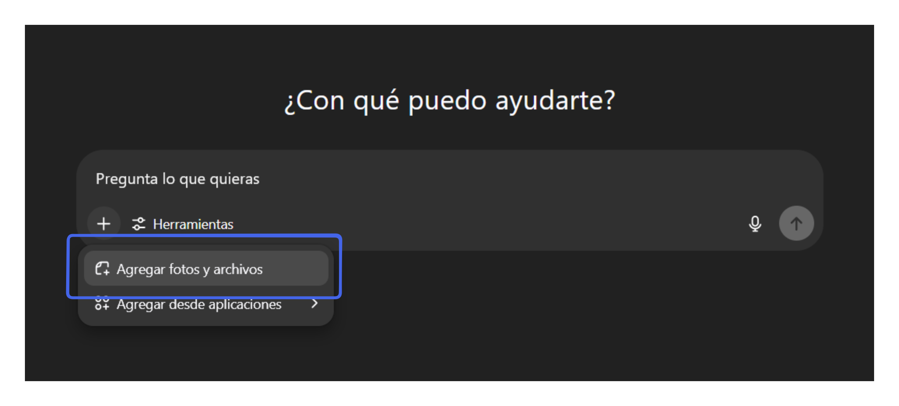
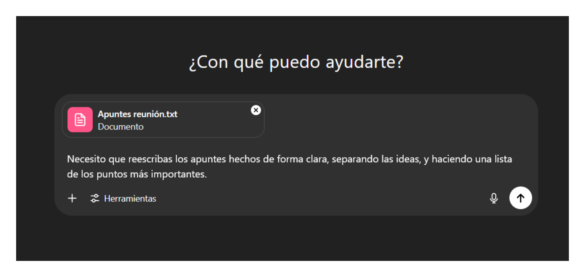

# Resumir documentos

En este artículo te mostraremos como puedes resumir un documento con contenido escrito entregándoselo a una herramienta como ChatGPT o DeepSeek.

## Eligiendo una herramienta

Hoy en día, la mayoría de IAs de texto permiten subir archivos. Para este artículo, usaremos ChatGPT.

## Seleccionando el documento

En la página principal de ChatGPT, selecciona la cruz dándole click.



Luego, selecciona "agregar fotos y archivos", lo cual te dirigirá al explorador de archivos.



Una vez que selecciones el archivo solo faltará indicar qué necesitas hacer con este. Resumirlo, describir capítulos específicos, describir la idea principal, ¡lo que necesites!



## Prompts sugeridos

Análisis de un artículo académico

```Prompt
He subido un artículo académico. Quiero que lo analices críticamente:
identifica la tesis central, los principales argumentos, la metodología
utilizada (si la hay), y las conclusiones. Luego, evalúa su claridad,
solidez argumentativa y posibles limitaciones o sesgos. Finalmente,
sugiéreme preguntas o temas que se podrían discutir con estudiantes
a partir de este texto.
```

Resumen de un texto complejo

```Prompt
He subido un capítulo de un libro denso y técnico. Necesito que me
generes un resumen claro y estructurado, pensando en estudiantes
universitarios. Incluye: ideas clave, términos técnicos explicados
de forma sencilla, y ejemplos prácticos que ayuden a entender el
contenido. No omitas conceptos importantes, pero simplifica sin
perder profundidad.
```
