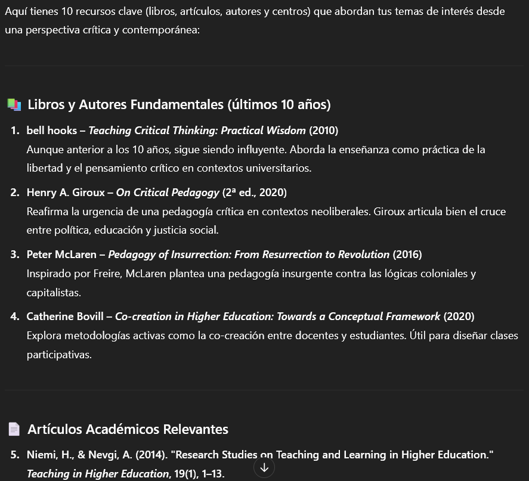

# Buscando bibliografía
A veces la búsqueda de contenido o bibliografía actualizada puede ser un reto para cualquier docente. A continuación, te mostramos distintos prompts que podrán ayudarte en esta tarea.

## Prompt para buscar bibliografía
Este prompt te entragará una lista de bibliografía relevante.
```Prompt
Soy docente universitario en [área específica], y estoy buscando bibliografía
pedagógica y académica relevante para actualizar mis contenidos y enriquecer
mi práctica docente. Necesito que me ayudes a encontrar [cantidad] recursos de
calidad (pueden ser libros, artículos académicos, autores influyentes,
universidades, papers actuales, investigaciones, o repositorios digitales),
que estén bien valorados en el ámbito académico y sean útiles tanto para mi
formación como para trabajar con estudiantes universitarios. Prioriza fuentes
confiables (editoriales reconocidas, revistas indexadas, universidades, etc.),
y si es posible, incluye recursos de acceso abierto o fáciles de conseguir.
Dame una breve descripción de cada recurso y por qué sería útil en mi labor docente o investigativa.
```
Deberás cambiar:
* [Área específica] (educación, filosofía, sociología, ciencias cognitivas, etc.)
* [Cantidad]

::: details Ejemplo
Instrucción:
Soy docente de pedagogía universitaria interesado en enfoques críticos y contemporáneos de enseñanza-aprendizaje. Necesito que me recomiendes 10 recursos bibliográficos (libros, artículos o autores) que aborden temas como pedagogía crítica, evaluación formativa, metodologías activas y uso de tecnologías en la educación superior. Prioriza publicaciones recientes (últimos 10 años), autores influyentes como Paulo Freire, bell hooks, o similares, y si hay centros o revistas académicas de referencia, inclúyelos también.

Respuesta de ChatGPT:


:::