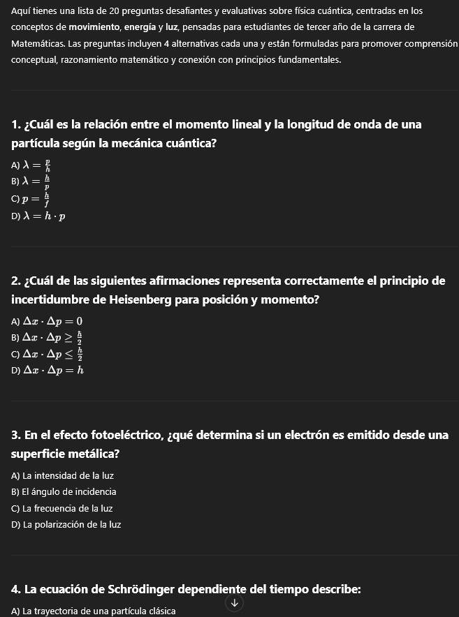
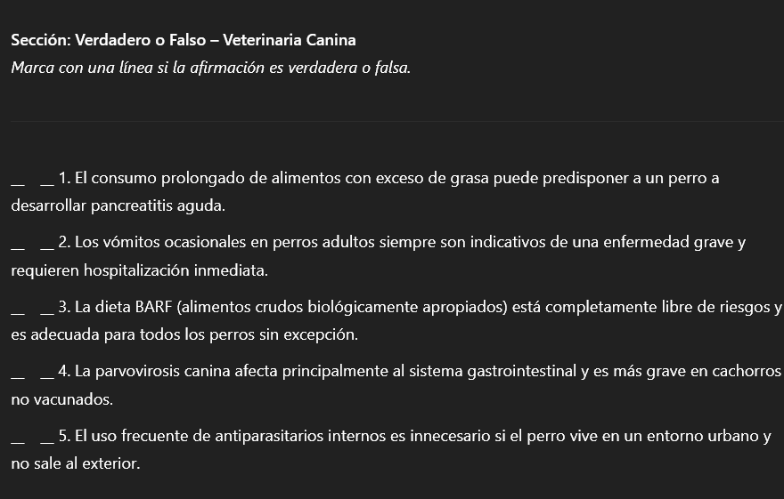
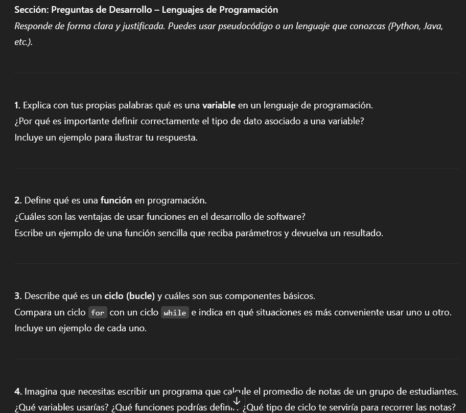

# Creando una guía de trabajo
En este artículo te compartiremos prompts para que puedas generar preguntas y ejercicios personalizados para tus estudiantes, los cuales podrás colocar en tus presentaciones o guías según lo prefieras.
::: tip ¡Recuerda!
Puedes copiar y pegar fácilmente estos prompts presionando el botón de copiar o seleccionando el texto.
:::

## Preguntas con alternativas
Estas son las preguntas convencionales con alternativas (a, b, c, d).
```Prompt
Entrega una lista ennumerada de [cantidad] preguntas sobre [tema],
con [cantidad de preguntas] alternativas para cada una,
orientadas en los siguientes conceptos claves: [lista de conceptos].
Estas preguntas deberán servirles a estudiantes de [año, carrera],
con un enfoque evaluativo y pedagógico. Deberán ser preguntas
desafiantes pero que no se salgan del contexto del tema.
Estoy realizando una [prueba, guía, etc.] para evaluar a los
estudiantes y sus conocimientos.
```
Deberás cambiar:
* [Cantidad]
* [Cantidad de preguntas]
* [Tema]
* [Lista de conceptos]
* [Año, carrera]
* [Prueba, guía, etc.]
::: details Ejemplo
Instrucción:
Entrega una lista ennumerada de 20 preguntas sobre física cuántica,
con 4 alternativas para cada una,
orientadas en los siguientes conceptos claves: movimiento, energía, luz.
Estas preguntas deberán servirles a estudiantes de tercer año, de la carrera de matematicas,
con un enfoque evaluativo y pedagógico. Deberán ser preguntas
desafiantes pero que no se salgan del contexto del tema.
Estoy realizando una guía evaluativa para evaluar a los
estudiantes y sus conocimientos.

Respuesta de ChatGPT:


:::

## Preguntas de verdadero o falso
Este prompt entregará preguntas de verdadero o falso con una línea para que el estudiante pueda ingresar V o F.
```Prompt
Entrega [cantidad] preguntas de verdadero o falso sobre [tema],
orientadas en los siguientes conceptos claves: [lista de conceptos].
Estas preguntas deberán servirles a estudiantes de [año, carrera],
con un enfoque evaluativo y pedagógico. Deberán ser preguntas
desafiantes pero que no se salgan del contexto del tema.
Estoy realizando una [prueba, guía, etc.] para evaluar a los
estudiantes y sus conocimientos.
Entrégalas con un formato apropiado para un documento digital,
con una línea horizontal al lado izquierdo de cada pregunta
para poder colocar verdadero o falso.
```
Deberás cambiar:
* [Cantidad]
* [Tema]
* [Lista de conceptos]
* [Año, carrera]
* [Prueba, guía, etc.]

::: details Ejemplo
Instrucción:
Entrega 5 preguntas de verdadero o falso sobre veterinaria canina,
orientadas en los siguientes conceptos claves: salud, problemas gastrointestinales, alimentación.
Estas preguntas deberán servirles a estudiantes de primer año de la carrera de Veterinaria,
con un enfoque evaluativo y pedagógico. Deberán ser preguntas
desafiantes pero que no se salgan del contexto del tema.
Estoy realizando una prueba evaluativa para evaluar a los
estudiantes y sus conocimientos.
Entrégalas con un formato apropiado para un documento digital,
con una línea horizontal al lado izquierdo de cada pregunta
para poder colocar verdadero o falso.

Respuesta de ChatGPT:

:::

## Preguntas de desarrollo
Este prompt entregará preguntas de desarrollo para que los estudiantes expliquen.

```Prompt
Entrega [cantidad] preguntas de desarrollo (donde el estudiante explica)
sobre [tema], orientadas en los siguientes conceptos claves: [lista de conceptos].
Estas preguntas deberán servirles a estudiantes de [año, carrera],
con un enfoque evaluativo y pedagógico. Deberán ser preguntas
desafiantes pero que no se salgan del contexto del tema.
Estoy realizando una [prueba, guía, etc.] para evaluar a los
estudiantes y sus conocimientos.
```
Deberás cambiar:
* [Cantidad]
* [Tema]
* [Lista de conceptos]
* [Año, carrera]
* [Prueba, guía, etc.]
::: details Ejemplo
Instrucción:
Entrega 5 preguntas de desarrollo (donde el estudiante explica)
sobre sobre lenguajes de programación, orientadas en los siguientes conceptos claves: variables, funciones, ciclos.
Estas preguntas deberán servirles a estudiantes de primer año de la carrera de Informática,
con un enfoque evaluativo y pedagógico. Deberán ser preguntas
desafiantes pero que no se salgan del contexto del tema.
Estoy realizando una evaluación de diagnóstico para evaluar a los
estudiantes y sus conocimientos.

Respuesta de ChatGPT:


:::