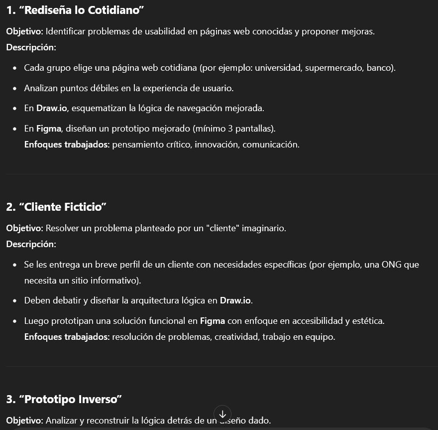
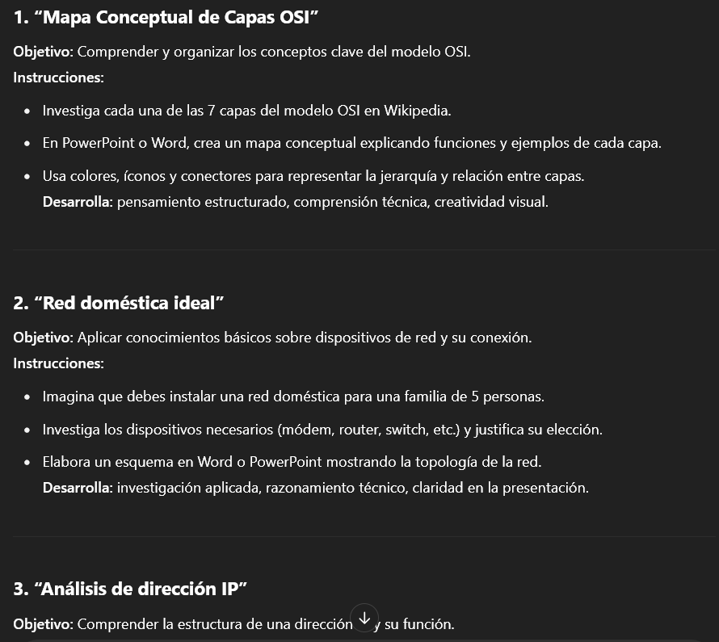

# Ideas para actividades
Muchas veces podrás quedarte sin ideas sobre qué hacer en una clase, ya sean actividades, trabajos o proyectos. Con la IA podrás hacer una lluvia de ideas organizada para idear actividades dinámicas, trabajos interesantes y proyectos desafiantes para tus estudiantes.

## Actividades grupales
Este prompt entregará una lista de actividades grupales.
```Prompt
Entrega una lista de [cantidad] actividades grupales entre [cantidad de personas]
estudiantes centradas en el siguiente tema: [tema]. Son estudiantes de [año, carrera],
donde desarrollen las siguientes aptitudes: [lista de aptitudes], actividades que
promuevan el trabajo en equipo, la comunicación y el compartir ideas.
Deberían tener una duración aproximada de [tiempo en minutos] minutos. Se usarán
las siguientes herramientas: [lista de herramientas]. Asegúrate de que sean
actividades pedagógicas y que promuevan el desarrollo personal, y para que
los estudiantes aprendan con actividades prácticas.
```
Deberás cambiar:
* [Cantidad]
* [Cantidad de personas]
* [Tema]
* [Año, carrera]
* [Lista de aptitudes]
* [Tiempo en minutos]
* [Lista de herramientas]

::: details Ejemplo
Instrucción:
Entrega una lista de 5 actividades grupales entre 3
estudiantes centradas en el siguiente tema: prototipado de páginas web. Son estudiantes de segundo año, de la carrera de Informática,
donde desarrollen las siguientes aptitudes: pensamiento crítico, resolución de problemas, innovación, creatividad, actividades que
promuevan el trabajo en equipo, la comunicación y el compartir ideas.
Deberían tener una duración aproximada de 90 minutos. Se usarán
las siguientes herramientas: Figma y Draw.io para la lógica. Asegúrate de que sean
actividades pedagógicas y que promuevan el desarrollo personal, y para que
los estudiantes aprendan con actividades prácticas.

Respuesta de ChatGPT:


:::

## Actividades individuales
Este prompt entregará una lista de actividades individuales.
```Prompt
Entrega una lista de [cantidad] actividades individuales,
centradas en el siguiente tema: [tema]. Son estudiantes de [año, carrera],
donde desarrollen las siguientes aptitudes: [lista de aptitudes].
Deberían tener una duración aproximada de [tiempo en minutos] minutos. Se usarán
las siguientes herramientas: [lista de herramientas]. Asegúrate de que sean
actividades pedagógicas y que promuevan el desarrollo personal, y para que
los estudiantes aprendan con actividades prácticas.
```
Deberás cambiar:
* [Cantidad]
* [Tema]
* [Año, carrera]
* [Lista de aptitudes]
* [Tiempo en minutos]
* [Lista de herramientas]

::: details Ejemplo
Instrucción:
Entrega una lista de 5 actividades individuales, centradas en el siguiente tema: redes y telecomunicaciones. Son estudiantes de primer año de la carrera de Redes y Telecomunicaciones, donde desarrollen las siguientes aptitudes: ipensamiento crítico, habilidades de investigación, trabajo autónomo, creatividad. Deberían tener una duración aproximada de 45 minutos. Se usarán las siguientes herramientas: ofimática, wikipedia. Asegúrate de que sean actividades pedagógicas y que promuevan el desarrollo personal, y para que los estudiantes aprendan con actividades prácticas.

Respuesta de ChatGPT:


:::