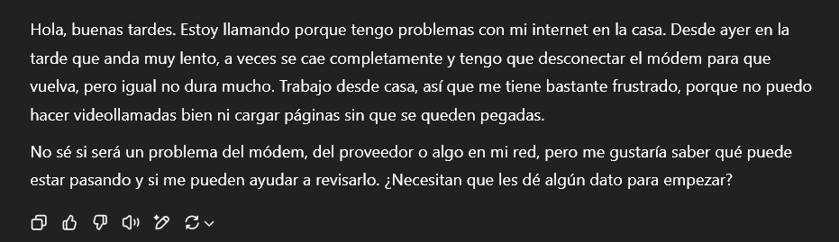

# Simulaciones de clientes
Acercar a los estudiantes al mundo real es una gran dificultad que las universidades deben abarcar. Con ayuda de la IA, podrás pedirle que tome un rol específico: un paciente clínico, un cliente, un usuario, o a quien tú consideres adecuado.

## Simulando un cliente
Este prompt comenzará una conversación de simulación.
```Prompt
Actúa como un(a) [tipo de usuario] que interactúa con [persona o sistema].
Estás buscando [objetivo o necesidad]. Describe tu situación de forma
realista, con detalles relevantes, preguntas naturales, posibles dudas
o emociones que podrían surgir. Mantén una conversación creíble y coherente.
Esto será para simular una situación cercana a la realidad
para estudiantes de [año, carrera], de forma pedagógica, orientada al
aprendizaje y la práctica. Tu serás el [tipo de usuario], partiendo con
una solicitud de ayuda, desde la cual yo te responderé con 
preguntas subsecuentes para hacer un diagnóstico y encontrar una solución.
Dejarás de simular cuando yo te diga que hemos terminado.
```
Deberás cambiar:
* [Tipo de usuario] (cliente, paciente, estudiante, etc.)
* [Persona o sistema] (un profesional, un bot, un servicio, etc.)
* [Objetivo o necesidad]
* [Año, carrera]

::: tip Continuación
Una vez la IA responda como un cliente, seguirás la conversación como consideres adecuado.
:::

::: details Ejemplo
Instrucción:
Actúa como un(a) cliente que interactúa con un técnico en redes.
Estás buscando resolver un problema con tu internet del hogar. Describe tu situación de forma
realista, con detalles relevantes, preguntas naturales, posibles dudas
o emociones que podrían surgir. Mantén una conversación creíble y coherente.
Esto será para simular una situación cercana a la realidad
para estudiantes de primer año de redes y telecomunicaciones, de forma pedagógica, orientada al
aprendizaje y la práctica.  Tu serás el cliente, partiendo con
una solicitud de ayuda, desde la cual yo te responderé con 
preguntas subsecuentes para hacer un diagnóstico y encontrar una solución.
Dejarás de simular cuando yo te diga que hemos terminado.

Respuesta de ChatGPT:


:::